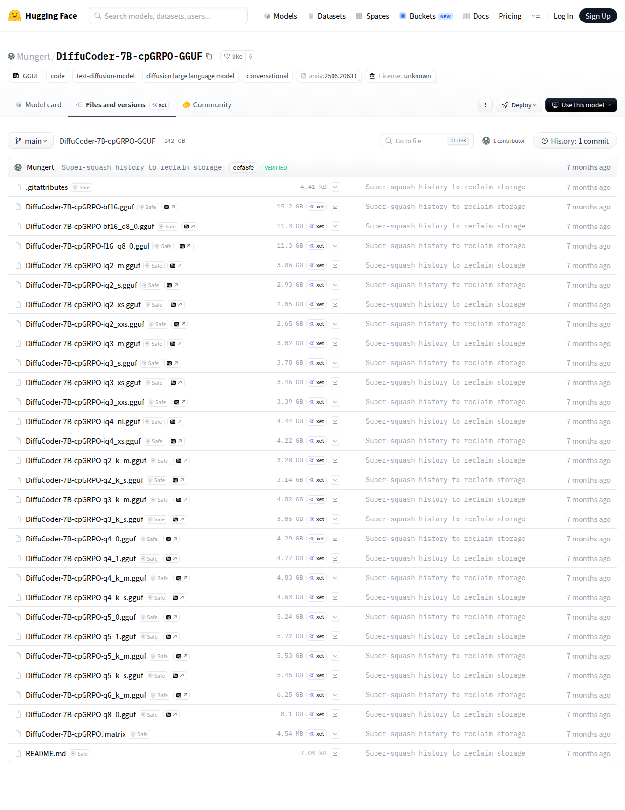

# Visited: https://huggingface.co/Mungert/DiffuCoder-7B-cpGRPO-GGUF/tree/main
**Time:** Tue May  5 00:31:46 UTC 2026

## Screenshot

## Raw HTML
[page.html](./page.html)

## Downloaded Media (1 files)
## Downloaded Media Files

## Other Links
- [/](/)
- [/Mungert](/Mungert)
- [/Mungert/DiffuCoder-7B-cpGRPO-GGUF](/Mungert/DiffuCoder-7B-cpGRPO-GGUF)
- [/Mungert/DiffuCoder-7B-cpGRPO-GGUF/blob/main/.gitattributes](/Mungert/DiffuCoder-7B-cpGRPO-GGUF/blob/main/.gitattributes)
- [/Mungert/DiffuCoder-7B-cpGRPO-GGUF/blob/main/DiffuCoder-7B-cpGRPO-bf16.gguf](/Mungert/DiffuCoder-7B-cpGRPO-GGUF/blob/main/DiffuCoder-7B-cpGRPO-bf16.gguf)
- [/Mungert/DiffuCoder-7B-cpGRPO-GGUF/blob/main/DiffuCoder-7B-cpGRPO-bf16_q8_0.gguf](/Mungert/DiffuCoder-7B-cpGRPO-GGUF/blob/main/DiffuCoder-7B-cpGRPO-bf16_q8_0.gguf)
- [/Mungert/DiffuCoder-7B-cpGRPO-GGUF/blob/main/DiffuCoder-7B-cpGRPO-f16_q8_0.gguf](/Mungert/DiffuCoder-7B-cpGRPO-GGUF/blob/main/DiffuCoder-7B-cpGRPO-f16_q8_0.gguf)
- [/Mungert/DiffuCoder-7B-cpGRPO-GGUF/blob/main/DiffuCoder-7B-cpGRPO-iq2_m.gguf](/Mungert/DiffuCoder-7B-cpGRPO-GGUF/blob/main/DiffuCoder-7B-cpGRPO-iq2_m.gguf)
- [/Mungert/DiffuCoder-7B-cpGRPO-GGUF/blob/main/DiffuCoder-7B-cpGRPO-iq2_s.gguf](/Mungert/DiffuCoder-7B-cpGRPO-GGUF/blob/main/DiffuCoder-7B-cpGRPO-iq2_s.gguf)
- [/Mungert/DiffuCoder-7B-cpGRPO-GGUF/blob/main/DiffuCoder-7B-cpGRPO-iq2_xs.gguf](/Mungert/DiffuCoder-7B-cpGRPO-GGUF/blob/main/DiffuCoder-7B-cpGRPO-iq2_xs.gguf)
- [/Mungert/DiffuCoder-7B-cpGRPO-GGUF/blob/main/DiffuCoder-7B-cpGRPO-iq2_xxs.gguf](/Mungert/DiffuCoder-7B-cpGRPO-GGUF/blob/main/DiffuCoder-7B-cpGRPO-iq2_xxs.gguf)
- [/Mungert/DiffuCoder-7B-cpGRPO-GGUF/blob/main/DiffuCoder-7B-cpGRPO-iq3_m.gguf](/Mungert/DiffuCoder-7B-cpGRPO-GGUF/blob/main/DiffuCoder-7B-cpGRPO-iq3_m.gguf)
- [/Mungert/DiffuCoder-7B-cpGRPO-GGUF/blob/main/DiffuCoder-7B-cpGRPO-iq3_s.gguf](/Mungert/DiffuCoder-7B-cpGRPO-GGUF/blob/main/DiffuCoder-7B-cpGRPO-iq3_s.gguf)
- [/Mungert/DiffuCoder-7B-cpGRPO-GGUF/blob/main/DiffuCoder-7B-cpGRPO-iq3_xs.gguf](/Mungert/DiffuCoder-7B-cpGRPO-GGUF/blob/main/DiffuCoder-7B-cpGRPO-iq3_xs.gguf)
- [/Mungert/DiffuCoder-7B-cpGRPO-GGUF/blob/main/DiffuCoder-7B-cpGRPO-iq3_xxs.gguf](/Mungert/DiffuCoder-7B-cpGRPO-GGUF/blob/main/DiffuCoder-7B-cpGRPO-iq3_xxs.gguf)
- [/Mungert/DiffuCoder-7B-cpGRPO-GGUF/blob/main/DiffuCoder-7B-cpGRPO-iq4_nl.gguf](/Mungert/DiffuCoder-7B-cpGRPO-GGUF/blob/main/DiffuCoder-7B-cpGRPO-iq4_nl.gguf)
- [/Mungert/DiffuCoder-7B-cpGRPO-GGUF/blob/main/DiffuCoder-7B-cpGRPO-iq4_xs.gguf](/Mungert/DiffuCoder-7B-cpGRPO-GGUF/blob/main/DiffuCoder-7B-cpGRPO-iq4_xs.gguf)
- [/Mungert/DiffuCoder-7B-cpGRPO-GGUF/blob/main/DiffuCoder-7B-cpGRPO-q2_k_m.gguf](/Mungert/DiffuCoder-7B-cpGRPO-GGUF/blob/main/DiffuCoder-7B-cpGRPO-q2_k_m.gguf)
- [/Mungert/DiffuCoder-7B-cpGRPO-GGUF/blob/main/DiffuCoder-7B-cpGRPO-q2_k_s.gguf](/Mungert/DiffuCoder-7B-cpGRPO-GGUF/blob/main/DiffuCoder-7B-cpGRPO-q2_k_s.gguf)
- [/Mungert/DiffuCoder-7B-cpGRPO-GGUF/blob/main/DiffuCoder-7B-cpGRPO-q3_k_m.gguf](/Mungert/DiffuCoder-7B-cpGRPO-GGUF/blob/main/DiffuCoder-7B-cpGRPO-q3_k_m.gguf)
- [/Mungert/DiffuCoder-7B-cpGRPO-GGUF/blob/main/DiffuCoder-7B-cpGRPO-q3_k_s.gguf](/Mungert/DiffuCoder-7B-cpGRPO-GGUF/blob/main/DiffuCoder-7B-cpGRPO-q3_k_s.gguf)
- [/Mungert/DiffuCoder-7B-cpGRPO-GGUF/blob/main/DiffuCoder-7B-cpGRPO-q4_0.gguf](/Mungert/DiffuCoder-7B-cpGRPO-GGUF/blob/main/DiffuCoder-7B-cpGRPO-q4_0.gguf)
- [/Mungert/DiffuCoder-7B-cpGRPO-GGUF/blob/main/DiffuCoder-7B-cpGRPO-q4_1.gguf](/Mungert/DiffuCoder-7B-cpGRPO-GGUF/blob/main/DiffuCoder-7B-cpGRPO-q4_1.gguf)
- [/Mungert/DiffuCoder-7B-cpGRPO-GGUF/blob/main/DiffuCoder-7B-cpGRPO-q4_k_m.gguf](/Mungert/DiffuCoder-7B-cpGRPO-GGUF/blob/main/DiffuCoder-7B-cpGRPO-q4_k_m.gguf)
- [/Mungert/DiffuCoder-7B-cpGRPO-GGUF/blob/main/DiffuCoder-7B-cpGRPO-q4_k_s.gguf](/Mungert/DiffuCoder-7B-cpGRPO-GGUF/blob/main/DiffuCoder-7B-cpGRPO-q4_k_s.gguf)
- [/Mungert/DiffuCoder-7B-cpGRPO-GGUF/blob/main/DiffuCoder-7B-cpGRPO-q5_0.gguf](/Mungert/DiffuCoder-7B-cpGRPO-GGUF/blob/main/DiffuCoder-7B-cpGRPO-q5_0.gguf)
- [/Mungert/DiffuCoder-7B-cpGRPO-GGUF/blob/main/DiffuCoder-7B-cpGRPO-q5_1.gguf](/Mungert/DiffuCoder-7B-cpGRPO-GGUF/blob/main/DiffuCoder-7B-cpGRPO-q5_1.gguf)
- [/Mungert/DiffuCoder-7B-cpGRPO-GGUF/blob/main/DiffuCoder-7B-cpGRPO-q5_k_m.gguf](/Mungert/DiffuCoder-7B-cpGRPO-GGUF/blob/main/DiffuCoder-7B-cpGRPO-q5_k_m.gguf)
- [/Mungert/DiffuCoder-7B-cpGRPO-GGUF/blob/main/DiffuCoder-7B-cpGRPO-q5_k_s.gguf](/Mungert/DiffuCoder-7B-cpGRPO-GGUF/blob/main/DiffuCoder-7B-cpGRPO-q5_k_s.gguf)
- [/Mungert/DiffuCoder-7B-cpGRPO-GGUF/blob/main/DiffuCoder-7B-cpGRPO-q6_k_m.gguf](/Mungert/DiffuCoder-7B-cpGRPO-GGUF/blob/main/DiffuCoder-7B-cpGRPO-q6_k_m.gguf)
- [/Mungert/DiffuCoder-7B-cpGRPO-GGUF/blob/main/DiffuCoder-7B-cpGRPO-q8_0.gguf](/Mungert/DiffuCoder-7B-cpGRPO-GGUF/blob/main/DiffuCoder-7B-cpGRPO-q8_0.gguf)
- [/Mungert/DiffuCoder-7B-cpGRPO-GGUF/blob/main/DiffuCoder-7B-cpGRPO.imatrix](/Mungert/DiffuCoder-7B-cpGRPO-GGUF/blob/main/DiffuCoder-7B-cpGRPO.imatrix)
- [/Mungert/DiffuCoder-7B-cpGRPO-GGUF/blob/main/README.md](/Mungert/DiffuCoder-7B-cpGRPO-GGUF/blob/main/README.md)
- [/Mungert/DiffuCoder-7B-cpGRPO-GGUF/commit/eefa8fed55a305031f2b6e337ad16dcf638c8d3d](/Mungert/DiffuCoder-7B-cpGRPO-GGUF/commit/eefa8fed55a305031f2b6e337ad16dcf638c8d3d)
- [/Mungert/DiffuCoder-7B-cpGRPO-GGUF/commits/main](/Mungert/DiffuCoder-7B-cpGRPO-GGUF/commits/main)
- [/Mungert/DiffuCoder-7B-cpGRPO-GGUF/discussions](/Mungert/DiffuCoder-7B-cpGRPO-GGUF/discussions)
- [/Mungert/DiffuCoder-7B-cpGRPO-GGUF/resolve/main/.gitattributes?download=true](/Mungert/DiffuCoder-7B-cpGRPO-GGUF/resolve/main/.gitattributes?download=true)
- [/Mungert/DiffuCoder-7B-cpGRPO-GGUF/resolve/main/DiffuCoder-7B-cpGRPO-bf16.gguf?download=true](/Mungert/DiffuCoder-7B-cpGRPO-GGUF/resolve/main/DiffuCoder-7B-cpGRPO-bf16.gguf?download=true)
- [/Mungert/DiffuCoder-7B-cpGRPO-GGUF/resolve/main/DiffuCoder-7B-cpGRPO-bf16_q8_0.gguf?download=true](/Mungert/DiffuCoder-7B-cpGRPO-GGUF/resolve/main/DiffuCoder-7B-cpGRPO-bf16_q8_0.gguf?download=true)
- [/Mungert/DiffuCoder-7B-cpGRPO-GGUF/resolve/main/DiffuCoder-7B-cpGRPO-f16_q8_0.gguf?download=true](/Mungert/DiffuCoder-7B-cpGRPO-GGUF/resolve/main/DiffuCoder-7B-cpGRPO-f16_q8_0.gguf?download=true)
- [/Mungert/DiffuCoder-7B-cpGRPO-GGUF/resolve/main/DiffuCoder-7B-cpGRPO-iq2_m.gguf?download=true](/Mungert/DiffuCoder-7B-cpGRPO-GGUF/resolve/main/DiffuCoder-7B-cpGRPO-iq2_m.gguf?download=true)
- [/Mungert/DiffuCoder-7B-cpGRPO-GGUF/resolve/main/DiffuCoder-7B-cpGRPO-iq2_s.gguf?download=true](/Mungert/DiffuCoder-7B-cpGRPO-GGUF/resolve/main/DiffuCoder-7B-cpGRPO-iq2_s.gguf?download=true)
- [/Mungert/DiffuCoder-7B-cpGRPO-GGUF/resolve/main/DiffuCoder-7B-cpGRPO-iq2_xs.gguf?download=true](/Mungert/DiffuCoder-7B-cpGRPO-GGUF/resolve/main/DiffuCoder-7B-cpGRPO-iq2_xs.gguf?download=true)
- [/Mungert/DiffuCoder-7B-cpGRPO-GGUF/resolve/main/DiffuCoder-7B-cpGRPO-iq2_xxs.gguf?download=true](/Mungert/DiffuCoder-7B-cpGRPO-GGUF/resolve/main/DiffuCoder-7B-cpGRPO-iq2_xxs.gguf?download=true)
- [/Mungert/DiffuCoder-7B-cpGRPO-GGUF/resolve/main/DiffuCoder-7B-cpGRPO-iq3_m.gguf?download=true](/Mungert/DiffuCoder-7B-cpGRPO-GGUF/resolve/main/DiffuCoder-7B-cpGRPO-iq3_m.gguf?download=true)
- [/Mungert/DiffuCoder-7B-cpGRPO-GGUF/resolve/main/DiffuCoder-7B-cpGRPO-iq3_s.gguf?download=true](/Mungert/DiffuCoder-7B-cpGRPO-GGUF/resolve/main/DiffuCoder-7B-cpGRPO-iq3_s.gguf?download=true)
- [/Mungert/DiffuCoder-7B-cpGRPO-GGUF/resolve/main/DiffuCoder-7B-cpGRPO-iq3_xs.gguf?download=true](/Mungert/DiffuCoder-7B-cpGRPO-GGUF/resolve/main/DiffuCoder-7B-cpGRPO-iq3_xs.gguf?download=true)
- [/Mungert/DiffuCoder-7B-cpGRPO-GGUF/resolve/main/DiffuCoder-7B-cpGRPO-iq3_xxs.gguf?download=true](/Mungert/DiffuCoder-7B-cpGRPO-GGUF/resolve/main/DiffuCoder-7B-cpGRPO-iq3_xxs.gguf?download=true)
- [/Mungert/DiffuCoder-7B-cpGRPO-GGUF/resolve/main/DiffuCoder-7B-cpGRPO-iq4_nl.gguf?download=true](/Mungert/DiffuCoder-7B-cpGRPO-GGUF/resolve/main/DiffuCoder-7B-cpGRPO-iq4_nl.gguf?download=true)
- [/Mungert/DiffuCoder-7B-cpGRPO-GGUF/resolve/main/DiffuCoder-7B-cpGRPO-iq4_xs.gguf?download=true](/Mungert/DiffuCoder-7B-cpGRPO-GGUF/resolve/main/DiffuCoder-7B-cpGRPO-iq4_xs.gguf?download=true)

## Stats
- Links: 91
- Media: 1
