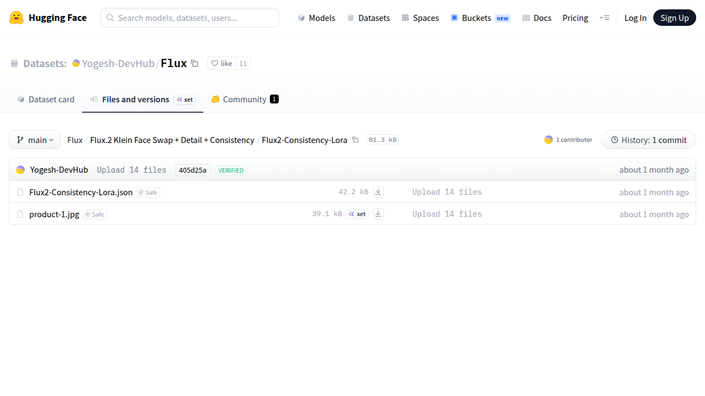

# Visited: https://huggingface.co/datasets/Yogesh-DevHub/Flux/tree/main/Flux.2%20Klein%20Face%20Swap%20%2B%20Detail%20%2B%20Consistency/Flux2-Consistency-Lora
**Time:** Tue May  5 10:36:20 UTC 2026

## Screenshot

## Raw HTML
[page.html](./page.html)

## Downloaded Media (0 files)
_No media files downloaded_

## Other Links
- [/](/)
- [/Yogesh-DevHub](/Yogesh-DevHub)
- [/datasets](/datasets)
- [/datasets/Yogesh-DevHub/Flux](/datasets/Yogesh-DevHub/Flux)
- [/datasets/Yogesh-DevHub/Flux/blob/main/Flux.2%20Klein%20Face%20Swap%20%2B%20Detail%20%2B%20Consistency/Flux2-Consistency-Lora/Flux2-Consistency-Lora.json](/datasets/Yogesh-DevHub/Flux/blob/main/Flux.2%20Klein%20Face%20Swap%20%2B%20Detail%20%2B%20Consistency/Flux2-Consistency-Lora/Flux2-Consistency-Lora.json)
- [/datasets/Yogesh-DevHub/Flux/commit/405d25a16f295b3a94aa031dd382ca7c490e1539](/datasets/Yogesh-DevHub/Flux/commit/405d25a16f295b3a94aa031dd382ca7c490e1539)
- [/datasets/Yogesh-DevHub/Flux/commits/main/Flux.2%20Klein%20Face%20Swap%20%2B%20Detail%20%2B%20Consistency/Flux2-Consistency-Lora](/datasets/Yogesh-DevHub/Flux/commits/main/Flux.2%20Klein%20Face%20Swap%20%2B%20Detail%20%2B%20Consistency/Flux2-Consistency-Lora)
- [/datasets/Yogesh-DevHub/Flux/discussions](/datasets/Yogesh-DevHub/Flux/discussions)
- [/datasets/Yogesh-DevHub/Flux/resolve/main/Flux.2%20Klein%20Face%20Swap%20%2B%20Detail%20%2B%20Consistency/Flux2-Consistency-Lora/Flux2-Consistency-Lora.json?download=true](/datasets/Yogesh-DevHub/Flux/resolve/main/Flux.2%20Klein%20Face%20Swap%20%2B%20Detail%20%2B%20Consistency/Flux2-Consistency-Lora/Flux2-Consistency-Lora.json?download=true)
- [/datasets/Yogesh-DevHub/Flux/resolve/main/Flux.2%20Klein%20Face%20Swap%20%2B%20Detail%20%2B%20Consistency/Flux2-Consistency-Lora/product-1.jpg?download=true](/datasets/Yogesh-DevHub/Flux/resolve/main/Flux.2%20Klein%20Face%20Swap%20%2B%20Detail%20%2B%20Consistency/Flux2-Consistency-Lora/product-1.jpg?download=true)
- [/datasets/Yogesh-DevHub/Flux/tree/main](/datasets/Yogesh-DevHub/Flux/tree/main)
- [/datasets/Yogesh-DevHub/Flux/tree/main/Flux.2%20Klein%20Face%20Swap%20%2B%20Detail%20%2B%20Consistency](/datasets/Yogesh-DevHub/Flux/tree/main/Flux.2%20Klein%20Face%20Swap%20%2B%20Detail%20%2B%20Consistency)
- [/docs](/docs)
- [/enterprise](/enterprise)
- [/front/build/kube-ee38de4/style.css](/front/build/kube-ee38de4/style.css)
- [/join](/join)
- [/js/script.js](/js/script.js)
- [/login](/login)
- [/models](/models)
- [/pricing](/pricing)
- [/spaces](/spaces)
- [/storage](/storage)
- [https://cdnjs.cloudflare.com/ajax/libs/KaTeX/0.12.0/katex.min.css](https://cdnjs.cloudflare.com/ajax/libs/KaTeX/0.12.0/katex.min.css)
- [https://de5282c3ca0c.edge.sdk.awswaf.com/de5282c3ca0c/526cf06acb0d/challenge.js](https://de5282c3ca0c.edge.sdk.awswaf.com/de5282c3ca0c/526cf06acb0d/challenge.js)
- [https://fonts.googleapis.com/css2?family=IBM+Plex+Mono:wght@400;600;700&display=swap](https://fonts.googleapis.com/css2?family=IBM+Plex+Mono:wght@400;600;700&display=swap)
- [https://fonts.googleapis.com/css2?family=Source+Sans+Pro:ital,wght@0,200;0,300;0,400;0,600;0,700;1,200;1,300;1,400;1,600;1,700&display=swap](https://fonts.googleapis.com/css2?family=Source+Sans+Pro:ital,wght@0,200;0,300;0,400;0,600;0,700;1,200;1,300;1,400;1,600;1,700&display=swap)
- [https://fonts.gstatic.com](https://fonts.gstatic.com)
- [https://huggingface.co/datasets/Yogesh-DevHub/Flux/tree/main/Flux.2%20Klein%20Face%20Swap%20%2B%20Detail%20%2B%20Consistency/Flux2-Consistency-Lora](https://huggingface.co/datasets/Yogesh-DevHub/Flux/tree/main/Flux.2%20Klein%20Face%20Swap%20%2B%20Detail%20%2B%20Consistency/Flux2-Consistency-Lora)

## Stats
- Links: 31
- Media: 0
